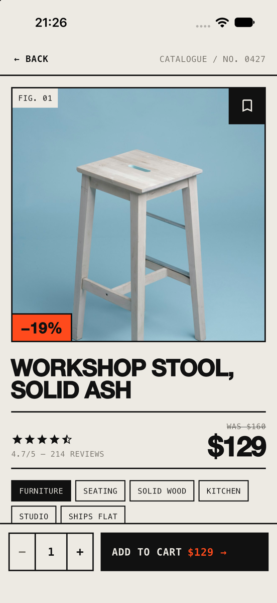

# Lab 5 — Adaptive E-Commerce Item Detail Screen

A Flutter product preview screen styled like a printed catalogue spec sheet,
built to lay out cleanly on every screen size with zero RenderFlex overflow.



## Task

- Create a Product Preview screen with a **Stack** cover image & bookmark badge.
- Arrange product title, star rating, price, and category badges with **Row** and **Wrap**.
- Build a bottom sticky action bar with an "Add to Cart" button occupying full width via **Expanded**.
- Ensure zero RenderFlex overflow on small and large screens.

## How each requirement is met

| Requirement | Where | How |
|---|---|---|
| Stack cover + bookmark badge | `CoverImage` in `lib/product_screen.dart` | `Stack` with the photo, a "FIG. 01" label, a tappable bookmark tile in the top-right corner (black → orange when saved), and a "−19%" discount stamp |
| Row for rating & price | `ProductDetails` | `Row` with the rating in `Expanded` on the left and the price on the right, so the price can never be pushed off-screen |
| Wrap for badges | `ProductDetails`, `StarRating` | Category badges sit in a `Wrap` and flow onto new lines; the review count also wraps under the stars |
| Sticky bar + Expanded | `BottomActionBar` | Set as the Scaffold's `bottomNavigationBar` so it stays pinned while content scrolls; the quantity stepper has a fixed width and "Add to Cart" fills the rest via `Expanded` |
| Zero overflow | throughout | Content scrolls; long text wraps or ellipsizes; `FittedBox(scaleDown)` shrinks the stars and button label instead of overflowing; screens ≥ 720 px wide switch to a side-by-side layout |

## Project structure

```
lib/
├── main.dart            app entry point and theme setup
├── theme.dart           colours, fonts, border lines
├── product.dart         Product model and sample data
└── product_screen.dart  the screen and all its widgets
test/
└── widget_test.dart     overflow tests
```

## Run it

```sh
flutter pub get
flutter run
```

## Tests

```sh
flutter test
```

The widget tests render the screen at 320×568 (small phone), 390×844 (phone),
820×1180 (tablet) and 1440×900 (desktop), plus 320×568 at 150% text size.
Each one fails if any RenderFlex overflows, and also checks that the bookmark
badge toggles and the "Add to Cart" button is present.

## Credits

Product photo from [Unsplash](https://unsplash.com), loaded over the network
(a placeholder is shown when offline).
